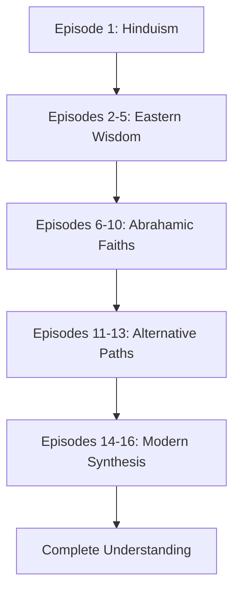

# 🌍 Awaken & Arise: A Journey Through World Religions


> **A comprehensive 16-episode documentary series exploring humanity's greatest spiritual traditions—from ancient Hinduism to modern interfaith dialogue.**

---

## 📖 About the Series

**Awaken & Arise** is an in-depth exploration of the world's major religions and wisdom traditions. Each episode builds on the previous, creating a complete vocabulary for understanding humanity's universal search for meaning, purpose, and the sacred.

This series treats each tradition with intellectual rigor and respect, focusing on:
- 📜 Historical context and development
- 🧘 Core teachings and practices
- 🌏 Cultural impact and global spread
- 🔬 Contemporary relevance and challenges
- 🔗 Connections and contrasts with other traditions

---

## 🎬 Episode Guide

### 🕉️ Part I: Eastern Foundations (Episodes 1-5)

#### Episode 1: [Hinduism: The Eternal Way](https://www.youtube.com/watch?v=hlbP8LEIzII)
*3,500 Years of Living Wisdom*
- Explore Hinduism's extraordinary continuity from the Indus Valley Civilization to today
- Understand the non-dual philosophy of Atman and Brahman
- Learn about dharma, karma, and moksha as a complete life-structure
- Discover why adaptability helped Hinduism survive millennia

#### Episode 2: [Fire & Light: Zoroastrianism](https://www.youtube.com/watch?v=-qrZC0x4M44)
*How Ancient Persia Shaped the Modern World*
- Discover the world's first prophetic monotheism
- Explore cosmic dualism: Ahura Mazda vs. Angra Mainyu
- Learn how Zoroastrianism pioneered concepts of heaven, hell, and final judgment
- Understand the religion's profound influence on Judaism, Christianity, and Islam

#### Episode 3: [The Prince Who Woke Up](https://www.youtube.com/watch?v=40XEo8daW54)
*Buddha's Revolution Against Ancient India*
- Follow Prince Siddhartha's dramatic journey to enlightenment
- Understand the Four Noble Truths and the Eightfold Path
- Discover how Buddhism challenged the caste system
- Learn the meaning of the Middle Way

#### Episode 4: [The Man Who Became Buddha](https://www.youtube.com/watch?v=Do5PqjE7SW0)
*A Life of Awakening*
- Dive deeper into the personal story of Siddhartha Gautama
- Experience the emotional journey from prince to enlightened teacher
- Understand the human path to awakening
- Explore the founding of the Saṅgha

#### Episode 5: [Across Continents](https://www.youtube.com/watch?v=WWNhwQdrmCU)
*Buddhism's Global Journey*
- Trace Buddhism's 2,500-year spread across Asia
- Understand the development of Theravada and Mahayana schools
- Discover how Buddhism adapted to different cultures
- Explore Zen, Tibetan Buddhism, and modern Western influence

***

### ✡️ Part II: Abrahamic Traditions (Episodes 6-10)

#### Episode 6: [Covenant & Diaspora](https://www.youtube.com/watch?v=eYlE1pD76KQ)
*Judaism's 3,500-Year Resilience*
- Explore the meaning of covenant between God and the Jewish people
- Understand how the Torah became a portable homeland
- Learn about survival strategies through diaspora and persecution
- Discover the foundations of monotheism

#### Episode 7: [The Rebel Rabbi](https://www.youtube.com/watch?v=EdudLnF8e6k)
*How Christianity Emerged from Judaism*
- Examine Jesus of Nazareth's revolutionary teachings
- Understand the shift from law to grace, from nation to individual
- Explore the role of Paul in spreading Christianity
- Discover how a Jewish sect became a world religion

#### Episode 8: [From Empire to Kingdom](https://www.youtube.com/watch?v=yvYPQQdGOsg)
*How Christianity Conquered the World*
- Follow Christianity's transformation from persecution to power
- Explore Constantine's conversion and the Edict of Milan
- Understand the Council of Nicaea and the formation of orthodoxy
- Discover how Church and State became intertwined

#### Episode 9: [The Final Revelation](https://www.youtube.com/watch?v=qeHCdv2y9tQ)
*Islam's Rapid Rise & Golden Age*
- Learn about Prophet Muhammad and the birth of Islam
- Understand the Qur'an as the final Abrahamic revelation
- Explore the rapid expansion of the Caliphates
- Discover the dawn of the Islamic Golden Age

#### Episode 10: [Empire & Knowledge](https://www.youtube.com/watch?v=kx6cQCdUR_M)
*Islam's Medieval Golden Age*
- Explore the House of Wisdom and centers of learning
- Discover Islamic contributions to mathematics, medicine, and astronomy
- Understand the synthesis of reason and revelation
- Learn about figures like Ibn Sina (Avicenna) and Al-Razi

***

### 🌸 Part III: Alternative Paths (Episodes 11-13)

#### Episode 11: [Smaller Paths, Profound Teachings](https://www.youtube.com/watch?v=s1_al2g6B4g)
*Jainism & Sikhism*
- Explore Jainism's radical commitment to non-violence (ahiṃsā)
- Understand Sikhism's synthesis of Hindu and Islamic elements
- Learn about the Guru Granth Sahib and the Khalsa
- Discover why minority faiths hold profound wisdom

#### Episode 12: [The Way That Cannot Be Told](https://www.youtube.com/watch?v=ySoYyd3NZu8)
*Taoism's Philosophy of Flow*
- Explore the mysterious Dao De Jing and Lao Zi
- Understand wu wei (effortless action)
- Discover Taoist naturalism and harmony
- Learn Taoism's influence on Zen and Chinese culture

#### Episode 13: [Gods in Nature](https://www.youtube.com/watch?v=73a2T_96KfA)
*Shinto's Indigenous Wisdom*
- Explore Japan's indigenous spirituality
- Understand the concept of kami in nature
- Discover Shinto's unique syncretism with Buddhism
- Learn how ancient traditions survive in modern societies

***

### 🌐 Part IV: Synthesis & Future (Episodes 14-16)

#### Episode 14: [Meeting Modernity](https://www.youtube.com/watch?v=NXyBdoo8U90)
*Can Ancient Faiths Survive the 21st Century?*
- Examine universal challenges: science, secularism, technology
- Explore how traditions adapt to modern values
- Understand progressive vs. fundamentalist responses
- Discover the tension between preservation and relevance

#### Episode 15: [Common Ground](https://www.youtube.com/watch?v=yP0l3_4mq6w)
*Universal Values That Unite All Religions*
- Discover compassion as the universal ethic
- Explore shared human yearnings for transcendence
- Understand common ethical frameworks
- Learn what unites humanity's spiritual traditions

#### Episode 16: [The Sacred Quest Continues](https://www.youtube.com/watch?v=20k9BK2U7Zc)
*Religion's Role in Tomorrow's World (Series Finale)*
- Reflect on the complete journey through 16 traditions
- Explore interfaith cooperation and future possibilities
- Understand what "living religiously" means today
- Discover why the sacred quest continues

***

## 🎯 Who Should Watch

- **Students** of comparative religion, philosophy, and world history
- **Spiritual seekers** exploring different traditions
- **Educators** looking for comprehensive religious studies content
- **Anyone curious** about how billions find meaning and purpose
- **Interfaith dialogue participants** seeking deeper understanding

***

## 📊 Series Statistics

| Metric | Value |
|--------|-------|
| Total Episodes | 16 |
| Total Duration | ~3.5 hours |
| Traditions Covered | 10+ major religions |
| Geographic Scope | Global (India, Middle East, East Asia, West) |
| Time Span | 3,500 years of history |
| Approach | Academic + Accessible |

***

## 🔑 Key Concepts Covered

- **Eastern Philosophy**: Dharma, Karma, Moksha, Nirvāṇa, Wu Wei, Kami
- **Abrahamic Traditions**: Covenant, Monotheism, Prophecy, Revelation, Salvation
- **Comparative Themes**: Compassion, Transcendence, Community, Ethics, Meaning
- **Modern Issues**: Secularism, Science & Faith, Technology, Climate Crisis

***

## 📚 Learning Path



***

## 🌟 What Makes This Series Unique

1. **Interconnected Narrative**: Each episode builds vocabulary for the next
2. **Balanced Approach**: Neither apologetic nor dismissive of any tradition
3. **Historical Depth**: Traces 3,500 years of spiritual evolution
4. **Contemporary Relevance**: Addresses modern challenges and adaptations
5. **Comparative Analysis**: Reveals both unique insights and common ground

***

## 🔗 Resources

- **Full Playlist**: [YouTube Playlist](https://www.youtube.com/playlist?list=PL4ZnjqJ5pyZS3lFouw8LkrxlrmbIRUNr6)
- **Channel**: [The Fourth Horizon](https://www.youtube.com/@TheFourthHorizon)
- **Discussion**: Join the conversation in video comments

***

## 📝 Citation

If you use this series for educational purposes, please cite:

```
Awaken & Arise: A Journey Through World Religions (2025)
The Fourth Horizon
YouTube Playlist: https://www.youtube.com/playlist?list=PL4ZnjqJ5pyZS3lFouw8LkrxlrmbIRUNr6
```

***

## 🤝 Contributing

Found an error or have suggestions? Please:
1. Open an issue with specific timestamp and correction
2. Provide credible sources for factual claims
3. Respect the educational nature of the project

***

## 📜 License & Credits

**Content**: Educational documentary series
**Script & Narration**: Crafted from primary religious texts, scholarly sources, and historical research
**Approach**: Academically rigorous, culturally respectful, accessible to general audiences

***

## 🙏 Acknowledgments

This series stands on the shoulders of:
- Comparative religion scholars
- Primary religious texts and traditions
- Interfaith dialogue practitioners
- Academic institutions worldwide

***

## 🔖 Tags

`world-religions` `comparative-religion` `spirituality` `documentary` `education` `hinduism` `buddhism` `christianity` `islam` `judaism` `taoism` `shinto` `philosophy` `history` `interfaith`

***

**Start your journey**: [Episode 1 - Hinduism: The Eternal Way](https://www.youtube.com/watch?v=hlbP8LEIzII)

***

*Last Updated: November 2025*
